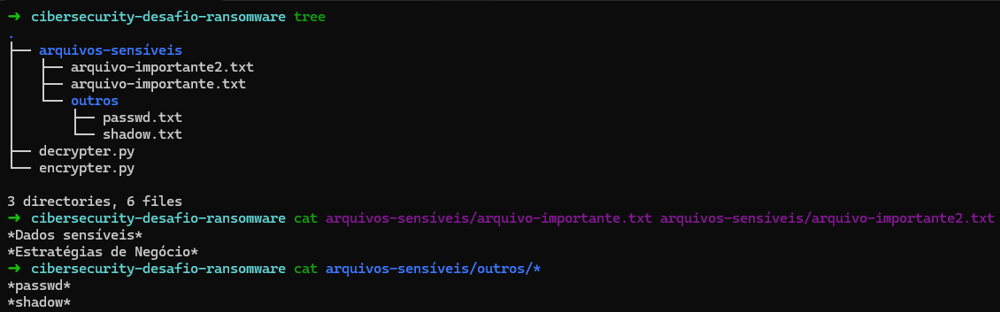
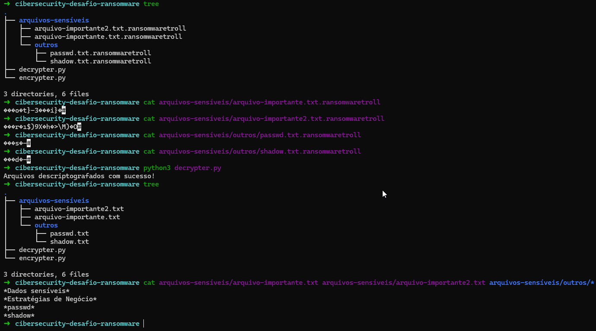

# cibersecurity-desafio-ransomware

Neste projeto, aprimorei um ransomware disponibilizado pelo cassiano-dio, a fim de cumprir um desafio proposto pela DIO.

## Modo de uso

No repositório teremos os arquivos **encrypt.py**, **decrypt.py** e o diretório **arquivos-sensíveis**.

Por padrão, ao executar `python3 encrypt.py` ele acessará o diretório **arquivos-sensíveis** e recursivamente encriptará todos os arquivos existentes lá dentro.
Com isso, basta executar `python3 decrypt.py` que ele realizará o processo inverso.

PS: Caso você se depare com o erro **No module named pyaes**, basta executar: `sudo apt install -y python3-pyaes`

##POC

